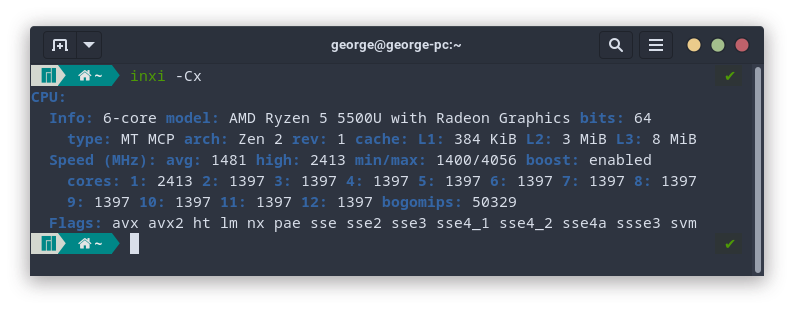

# Laboratory work

## **George Golubev** *21PMI-2*

## Список тем

> ### 1. [**System Info**](#1-system-info-1 "Задания 1 - 12")
>- [CPU](#cpu)
>- [RAM](#ram)
>- [DISK USAGE](#disk-usage)
>- [GPU](#gpu)
>- [NETWORK](#network)
>- [PROCESS INFO](#process-info)
> ###  2. [**System&nbsp;Environment**](#2-system-environment)
> ###  3. [**Grep**](#3-grep-1)
> ###  4. [**Find**](#4-find-1)
> ###  5. [**Bash**](#5-bash-1)
> ###  6. [**Administration**](#6-administration-1)

# 1. System Info
## **CPU**

----
**1.** Какими способами можно узнать информацию о CPU?


***Ответ:***  
  
**a)** 1. Вывести содержимое файла *cpuinfo* в директории *~/proc*: `cat /proc/cpuinfo`  
2. Используя комманду: `lscpu`.  
3. Используя комманду: `inxi -Cxa`

**b)** Команда для вывода: `inxi -Cx` . *Вывод команды:*  


----

## **RAM**

----

**1.** Что такое RAM и Swap?

***Ответ:***  
  
**RAM** *(Random Access Memory)* - память с произвольным доступом, то есть запрос к требуемой ячейке памяти происходит напрямую, другие блоки не затрагиваются. Также этот вид памяти называют энергозависимым, а значит, данные сохраняются в ней до тех пор, пока включено устройство, в котором она установлена.

**SWAP** *(от англ. swapping)* - один из механизмов виртуальной памяти, при котором отдельные фрагменты памяти (обычно неактивные) перемещаются из ОЗУ во вторичное хранилище (жёсткий диск или другой внешний накопитель, такой как флеш-память), освобождая ОЗУ для загрузки других активных фрагментов памяти. Такими фрагментами в современных ЭВМ являются страницы памяти.

---

**2.** Написать команду, которая выводит объем RAM/Swap.

***Ответ:*** `free`

---

**3.** Написать bash-script, который меняет размер Swap.  
  
***Ответ:***  
  
*`scripts/ram/change_swap_size.sh`*:
```bash
swapfile=$1
new_swap_size=$2

if [ $# -eq 0 ]; then
    echo "No arguments"
    exit
fi

if [ -z "$1" ]; then
    echo "No swapfile name"
    exit
fi

if [ -z "$2" ]; then
    echo "No swapfile size"
    exit
fi


swapoff $swapfile

dd if=/dev/zero of=$swapfile bs=1M count=$new_swap_size status=progress

chmod 600 $swapfile

mkswap $swapfile

swapon $swapfile
```

----

**4.** Для тех, у кого не гостевая Linux-система (т.е. основная). Написать команду, которая выводит информацию о типе используемой RAM (название, производитель, серийный номер, формат, объем, текущую частоту работы).  
  
***Ответ:*** `sudo dmidecode -t memory`  
***Вывод:***


----

## **DISK USAGE**


----

## **GPU**

----

## **NETWORK**

----

## **PROCESS INFO**

----


# 2. **System Environment**

# 3. **Grep**

# 4. **Find**

# 5. **Bash**

# 6. **Administration**